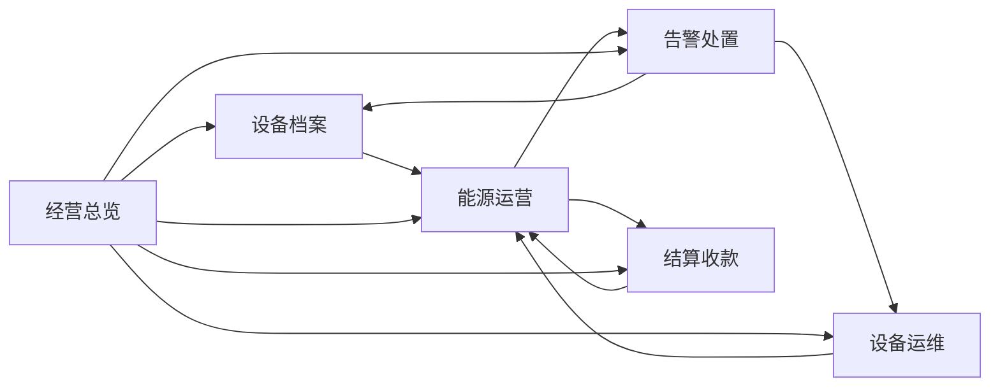

# 智园能管业务闭环设计（Platform）

这份文档不按 CRUD 讲，而按父业务域讲。每个父模块都是一个完整业务，子页面只负责闭环中的一个环节。

## 业务分层

- 资产层：组织、网关、设备、设备类型、测点、协议映射
- 运行层：实时监控、历史分析、数据质量
- 事件层：告警、指令、操作审计
- 经营层：计费、账单、缴费、复盘

## 总体闭环

## 1. 经营总览

### 业务目标

把全系统状态收口成一个驾驶舱，回答“当前园区是否正常运营”。

### 子页面

- 经营总览

### 当前接口

- `GET /api/platform/workspace/cockpit`
- `GET /api/platform/dashboard/summary`

### 应该承接的能力

- 组织/园区切换
- 设备在线率、离线率、故障率
- 今日用能、趋势、峰值、质量概览
- 告警待处理、账单待收、指令待回执
- 点击卡片直达对应业务页

### 建议补强

- `rootOrgId` 级联过滤
- 待办聚合接口
- 指标钻取参数统一，例如 `orgId`、`deviceId`、`alarmId`
- 总览卡片要能回跳设备、告警、账单、运维页面

### 闭环结果

管理者从总览发现问题，直接进入对应子页面处理，处理结果再回写总览。

## 2. 设备档案

### 业务目标

把园区资产结构、接入关系和投运状态建成一个可追溯的资产中枢。

### 子页面

- 组织档案树
- 设备档案

### 当前接口

- `GET /api/platform/archive/org-tree`
- `GET /api/platform/archive/device-tree`
- `GET /api/platform/archive/root-orgs`
- `GET /api/platform/archive/devices/{id}/archive-profile`
- `GET /api/platform/archive/orgs/{id}/archive-profile`
- `GET /api/platform/archive/gateways/{id}/archive-profile`

### 组织档案树应该承接的能力

- 组织、网关、设备的层级关系
- 新增、复制、编辑、删除时的链路校验
- 删除约束：有子节点不能删，有网关不能删，有设备不能删
- 右侧工作区随选中节点变化
- 从树节点跳转实时监控、历史分析、告警事件、指令追踪、账单关联

### 设备档案应该承接的能力

- 设备卡片展示
- 设备详情页：基础信息、实时数据、历史数据、告警数据、指令记录
- 设备投运检查
- 设备类型、测点定义、协议映射完整性检查
- 设备状态闭环：未配置、待接入、在线、离线、故障、停用

### 建议补强

- 新增设备投运检查接口
- 新增设备资产健康摘要接口
- 设备详情页展示“设备是否可计费、是否有完整测点、是否有最近告警”
- 设备详情页提供一键跳转到告警、运维、结算

### 闭环结果

一台设备从建档、接入、上线、监测、告警、计费到停用，始终围绕同一资产主键流转。

## 3. 能源运营

### 业务目标

把采集、分析、质量治理做成一个闭环，而不是三个孤立页面。

### 子页面

- 实时监控工作台
- 历史数据分析
- 能耗统计与数据质量

### 当前接口

- `GET /api/platform/energy/realtime/devices/{deviceId}`
- `GET /api/platform/energy/history`
- `GET /api/platform/energy/history/series`
- `GET /api/platform/energy/statistics/daily`
- `GET /api/platform/energy/ranking`
- `GET /api/platform/energy/trend`
- `GET /api/platform/energy/alarms`
- `POST /api/platform/statistics/daily/rebuild`

### 实时监控应该承接的能力

- 当前设备实时测点
- 曲线联动
- 离线、异常、长时间无数据高亮
- 从实时点直接跳到设备详情或告警

### 历史数据分析应该承接的能力

- 多设备、多测点、多时间范围对比
- 历史曲线和表格切换
- 峰谷分析、同比环比、异常区间标记
- 从异常时间点回跳告警和设备

### 数据质量应该承接的能力

- 完整率
- 缺失点
- 数据突变
- 重算任务
- 补采或修正后的质量恢复

### 建议补强

- 增加数据质量事件表或任务表
- 增加历史分析快照，便于复盘
- 增加异常点触发告警的规则
- 重算任务结果写入审计

### 闭环结果

能源运营不仅展示数据，还负责发现数据是否可信，并把异常反馈给告警、设备和结算。

## 4. 告警处置

### 业务目标

把告警做成可追踪的事件闭环，不只是列表页。

### 子页面

- 告警事件中心
- 告警处置台

### 当前接口

- `GET /api/platform/alarms/events`
- `GET /api/platform/alarms/summary`
- `GET /api/platform/alarms/rules`
- `POST /api/platform/alarms/events/{alarmId}/deal`
- `POST /api/platform/alarms/events/batch-deal`

### 应该承接的能力

- 告警发现
- 告警分类、分级、归属组织
- 待处理、处理中、已恢复、已关闭、误报、忽略
- 告警关联设备实时/历史数据
- 告警关联最近指令和处置人

### 建议补强

- 告警确认、升级、抑制、关闭接口
- 告警处置单独的状态流转
- 告警处置结果关联设备与账单

### 闭环结果

规则触发告警后，不只是“处理一下”，而是形成可复盘的事件链。

## 5. 结算收款

### 业务目标

把用量统计、计费规则、账单生成和缴费串成经营闭环。

### 子页面

- 结算工作台
- 账单中心

### 当前接口

- `GET /api/platform/billing/accounts`
- `GET /api/platform/billing/rules`
- `GET /api/platform/billing/rule-scopes`
- `GET /api/platform/billing/price-items`
- `GET /api/platform/billing/bills`
- `GET /api/platform/billing/payments`
- `POST /api/platform/billing/bills/preview`
- `POST /api/platform/billing/bills/generate`
- `POST /api/platform/billing/bills/{billId}/pay`
- `POST /api/platform/billing/bills/{billId}/recalculate`
- `POST /api/platform/billing/bills/{billId}/void`

### 结算工作台应该承接的能力

- 计费账户完整性检查
- 计费规则和适用范围检查
- 阶梯价格、计价方式、计费周期校验
- 用量和质量前置校验
- 账单预览、风险提示、生成确认

### 账单中心应该承接的能力

- 账单生命周期管理
- 账单快照查看
- 账单详情回跳到用量证据和设备证据
- 重算、作废、缴费、逾期处理

### 建议补强

- 账单生成前的“结算就绪度”判定
- 账单逾期扫描任务
- 账单异常原因码
- 账单与告警的关联视图

### 闭环结果

从数据质量到账单缴费形成完整经营闭环，账单不再是孤立财务单据。

## 6. 设备运维

### 业务目标

把接入诊断、控制指令、执行结果和设备健康打通。

### 子页面

- 接入诊断
- 设备控制台
- 指令追踪

### 当前接口

- `GET /api/platform/access/gateways/status`
- `GET /api/platform/access/raw-messages`
- `POST /api/platform/access/commands`
- `GET /api/platform/access/commands`
- `GET /api/platform/access/commands/{commandId}`
- `GET /api/platform/access/command-targets`
- `GET /api/platform/access/command-types`

### 应该承接的能力

- 设备在线诊断
- 原始报文查看
- 指令模板化下发
- 指令执行结果回执
- 失败原因归类
- 从指令回跳设备详情和告警

### 建议补强

- 指令重试
- 指令超时机制
- 指令结果和设备健康评分联动

### 闭环结果

发现问题后可以直接处理，处理后再验证恢复，最后写入审计。

## 7. 个人中心

### 业务目标

做成“我的工作台”，不是静态资料页。

### 应该承接的能力

- 我的组织范围
- 我的角色与权限
- 我的待办告警
- 我的待执行指令
- 我的最近操作
- 我的常用入口

### 闭环结果

个人中心是个人工作闭环的入口，直接承接权限、组织、待办和审计。

## 实施顺序建议

1. 设备档案闭环
2. 告警处置闭环
3. 结算收款闭环
4. 能源运营质量闭环
5. 设备运维闭环

